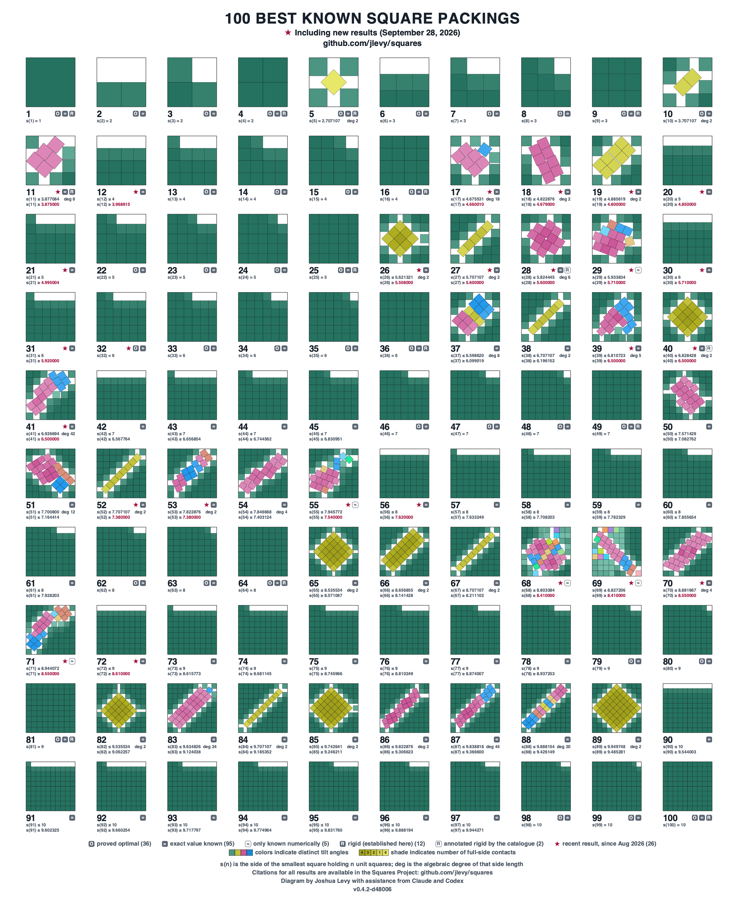

# The Squares Project

The Squares Project studies `s(n)`, the side of the smallest square that holds `n`
non-overlapping unit squares.
The problem is elementary to state and remains open even at small `n`. Its central case
is eleven squares, where the verified bracket is `3.875 < s(11) ≤ 3.8770835…`, a gap of
about `0.0021`.

This repository contains:

- **[New results from this project](#new-results):** Lower bounds on `s(11)` that
  improve Stromquist’s `3.7888543…` bound, stated in
  [1984, Memo III, p. 10](packing/resources/papers/stromquist-1984-packing-unit-squares-inside-squares-iii-cases-through-65-and-gardner-conjecture.pdf)
  and published in 2003; the recorded search found no improvement in between.
  The strongest is `s(11) ≥ 3.8269975…`. With them come `s(12) ≥ 99/25`, reached
  independently of Evan Daniel’s stronger `15680/3951`, which was in his repository from
  25 August and was first seen here on 27 September; the first proved bounds specific to
  twenty and twenty-one squares; and bounds for seventeen through twenty-one squares
  that improved on the published ones.
  The bounds for eighteen, nineteen and twenty squares are still the verified ones, with
  wand125’s reported `939/200`, `963/200` and `979/200` above them until their replays
  run; the others have since been raised by the results below.
- **[Results by others](#results-by-others):** Others have built on these certificates,
  credited them and taken the bounds further, and others have worked in parallel, one
  from the same weighted method and two on smaller packings.
  This repository registers each claimed bound as *reported* when it takes the source
  in, and as *verified* only after a complete replay of its certificate here and, for a
  lower bound, a review of its mathematics, with the credit its authors give.
  - **`s(11) > 31/8 = 3.875`**, by Kleddamag, developed from T-026’s certificate:
    [Kleddamag/11-squares-certified-bound `v1.0.2`](https://github.com/Kleddamag/11-squares-certified-bound/releases/tag/v1.0.2).
    It is the strongest verified lower bound for eleven squares, about `0.0021` below
    Trump’s packing. Recorded here: the
    [retained copy](packing/resources/web/external-square-certificates-2026-09-22/kleddamag-11/README.md),
    the [review](docs/project/reviews/review-2026-09-22-kleddamag-n11-mathematics.md)
    and the [case record](packing/frontier/n-011.md).
  - **`s(17) > 116511/25000 = 4.66044`**, by Guzhou0806, continuing Kleddamag’s
    `4.66001` charge (Kleddamag building on Squares Project (Joshua Levy), Mira and
    Guzhou0806):
    [Guzhou0806/n17-square-packing R068 at `815b162`](https://github.com/Guzhou0806/n17-square-packing/tree/815b16261f852e389968513eec94b4b9e5b3206d/certificates/R068-C010).
    Eight replayed certificates at seventeen squares trace their support back to T-019’s
    atoms, and this is the strongest; it is the verified lower bound, about `0.0151`
    below Bidwell’s packing.
    Recorded here: the
    [retained copy](packing/resources/web/n17-guzhou-r068-2026-09-28/README.md), the
    [review](docs/project/reviews/review-2026-09-28-n17-guzhou-r067-r068.md) and the
    [case record](packing/frontier/n-017.md).
  - **`s(21) = 5`, `s(32) = 6` and `s(45) = 7`**, by Evan Daniel, independent of this
    project and building on Burns’s and Massaccesi’s weighted method: the first exact
    values of `s(k² − 4)` for `k ≥ 4`. His `s(12) ≥ 15680/3951`, wand125’s and
    Tokoharu’s point and rectangle-density bounds for `n = 18` to `95`, and wand125’s
    `s(50) ≥ 37/5` are registered the same way, most of wand125’s still as reported
    bounds pending replay.
  - **Smaller packings at fifty counts**, by Francisco Couzo, 49 counts from `n = 68` to
    `307` ([T-056](packing/frontier/RESULTS.md)), and Joost de Winter,
    `s(211) ≤ 14.9979607… < 15`, the first packing of 211 squares below the grid
    ([T-057](packing/frontier/RESULTS.md)). Each is certified exactly here by two
    checkers that share no code, and at `n = 206`, `259` and `305` the certified side
    trails the printed one by at most three units of its fifteenth decimal.
    Griffin Casson had published packings at 39 of Couzo’s counts earlier; Couzo’s are
    smaller at all of them.
    Couzo’s came to this record through jlevy/squares#227.
- **[A comprehensive survey of all known square packing results](#survey):** Every case
  `n = 1…100`, the primary literature retained and transcribed, and the bound a source
  *reports* kept apart from the bound this repository has *verified*. Fifty-five of its
  hundred cases carry a lower bound proved since 22 August 2026, reported or verified;
  in twenty-seven the verified bound itself is recent, three of those are this
  project’s, and three are new exact values.
- **[A set of tools and AI workflows for automated mathematical research](#autonomous-research-process):**
  The results and the survey are produced and checked by AI agents running a recorded
  process: hypotheses registered before measurement, every claim graded, every defect
  logged.

The [**v0.4.2 explainer page**](https://jlevy.github.io/squares/) starts with an
interactive point-certificate proof, then shows how threshold atoms and a dilation limit
reach T-026’s `s(11) ≥ 3.8264474…` bound, the certificate Kleddamag’s `31/8` was
developed from. Its figures are drawn from the point certificates they explain.

[](https://jlevy.github.io/squares/known-best-1-100.pdf)

*The retained `n = 1…100` atlas, with each packing normalized to its own container and
labeled by its best-known side upper bound.
For open cases, the strongest verified lower bound appears beneath it.
A crimson star marks a recent result, a verified lower bound proved since 22 August
2026; each bound’s source and credit are on the film’s citation line.
The image is available in [**SVG**](packing/atlas/known-best/known-best-1-100.svg),
[**PDF**](https://jlevy.github.io/squares/known-best-1-100.pdf), and
[**high-resolution PNG**](packing/atlas/known-best/known-best-1-100@2x.png).*

**The atlas is also a film.** The same drawing is built one square at a time, at
1080p60, each step naming the bound it reaches, where that bound comes from, and whether
this repository has certified it:
[**`n = 1…100`**](https://github.com/jlevy/squares/releases/download/v0.4.2/ascent-n1-100-1080p60-citations.mp4)
(2m 20s, 38 MB) and the
[**full `n = 1…324` ascent**](https://github.com/jlevy/squares/releases/download/v0.4.2/ascent-n1-324-1080p60-citations.mp4)
(8m 14s, 206 MB), both on the
[`v0.4.2` release](https://github.com/jlevy/squares/releases/tag/v0.4.2) with the
receipt that records what each file is and the page it was drawn from.
GitHub strips `<video>` from Markdown, so these are links rather than an inline player;
the [explainer page](https://jlevy.github.io/squares/) plays them.

The register now runs to `n = 324`, the end of the catalogue’s audited range, and a
second, poster-sized composite draws all of it:
[**`known-best-1-324`**](packing/atlas/known-best/known-best-1-324.png), an 18-by-18
grid with the same cards, badges and legend, available as
[**SVG**](packing/atlas/known-best/known-best-1-324.svg) and
[**PDF**](packing/atlas/known-best/known-best-1-324.pdf) (44 by 51 inches).
The first figure is unchanged; the [atlas README](packing/atlas/known-best/README.md)
describes both.

[New Results](#new-results) · [Results by Others](#results-by-others) ·
[Research Status](SYNOPSIS.md#research-program-status-and-roadmap) · [Survey](#survey) ·
[Repository Guide](#repository-guide) · [Getting Started](#getting-started) ·
[Reports](#reports) · [Autonomous Research Process](#autonomous-research-process) ·
[Conventions](#conventions) · [Layout](#layout)

## New Results

The [results register](packing/frontier/RESULTS.md) collects this project’s results, the
published results needed to interpret them, and every result by others since 22 August
2026 that this record registers, replays or reviews, each credited to its source.
Each result has a `T-NNN` ID and the classifications defined in
[`epistemics.md`](epistemics.md): **V**, the highest verification rung supported by its
cited evidence, and **C**, what this repository has recorded or performed itself.
The gate checks the structural support for both classifications.
`apparently-novel` means a recorded source search did not find the named contribution;
it is not a claim of priority.
`confirmed-novel` means priority was confirmed outside this repository.
The New Results section covers both labels.

Each result also carries **S**, a significance score from `1` to `5` against the same
file’s rubric: `S4` is its anchor for a reusable technique, bound family or resolved
disputed value, and `S5` for movement on a central open case.

The central thread is `s(11)`, the smallest open case.
T-010 repaired the printed argument behind Stromquist’s `2 + 4/√5 = 3.788854…`; T-018
passed it with a weighted fractional certificate at `381/100 = 3.81`, whose
[proof card](packing/cases/n11_fractional_certificate/t-018-proof-card.md) states the
whole proof and the one command that checks it; threshold atoms and exact dilation
limits then carried this project’s bound to T-033’s `3.8269975…`. Kleddamag’s `31/8`,
developed from T-026’s threshold certificate, now holds the case and is listed under
[Results by Others](#results-by-others).

Every result first established here, as far as the recorded source searches show, has a
row below, highest `S` first and then newest.
The table is generated from the register by `devtools.render_recent_results`; the
register and the case records the `n` column links hold each result’s full statement,
evidence and limitations.
**Standing** is derived from the case records, never stored: `holds` where a case’s
verified bound rests on the result, `holds, reported` where only a reported bound does,
`second certificate` for another proof of an exact value that another result holds,
`superseded` for any other bound that no case holds now, and `—` for a result that is
not a bound.

<!-- BEGIN GENERATED: new-results (devtools.render_recent_results) -->

| Result | `n` | Headline | V | C | S | Established | Standing |
| --- | --- | --- | --- | --- | --- | --- | --- |
| [T-026](packing/frontier/RESULTS.md) | [11](packing/frontier/n-011.md) | `s(11) ≥ 955000√(518400042893309449)/179696714646249 = 3.8264474…` | V4 | C5 | S5 | 2026-09-09 | superseded |
| [T-025](packing/frontier/RESULTS.md) | [11](packing/frontier/n-011.md) | `s(11) ≥ 191/50 = 3.82`, by a threshold certificate | V4 | C5 | S5 | 2026-09-09 | superseded |
| [T-024](packing/frontier/RESULTS.md) | [11](packing/frontier/n-011.md) | `s(11) ≥ 3175000√(518400042893309449)/598960960743657 = 3.8166095…` | V4 | C3 | S5 | 2026-09-09 | superseded |
| [T-022](packing/frontier/RESULTS.md) | [11](packing/frontier/n-011.md) | `s(11) ≥ 38100√(8100042893309449)/899996306539 = 3.8100257…` | V4 | C5 | S5 | 2026-09-06 | superseded |
| [T-018](packing/frontier/RESULTS.md) | [11](packing/frontier/n-011.md) | `s(11) ≥ 381/100 = 3.81` | V4 | C5 | S5 | 2026-09-04 | superseded |
| [T-020](packing/frontier/RESULTS.md) | 19–21 | `s(n) ≥ 24/5 = 4.80` for `n = 19, 20, 21` | V4 | C4 | S4 | 2026-09-04 | holds |
| [T-019](packing/frontier/RESULTS.md) | 17–19 | `s(n) ≥ 459/100 = 4.59` for `n = 17, 18, 19` | V4 | C4 | S4 | 2026-09-04 | superseded |
| [T-017](packing/frontier/RESULTS.md) | [12](packing/frontier/n-012.md) | `s(12) ≥ 99/25 = 3.96` | V4 | C4 | S4 | 2026-09-04 | superseded |
| [T-010](packing/frontier/RESULTS.md) | [11](packing/frontier/n-011.md) | `s(11) ≥ 2 + 4/√5`, by a repair of Stromquist 2003’s Figure 14 point set | V4 | C3 | S4 | 2026-08-24 | superseded |
| [T-036](packing/frontier/RESULTS.md) | [11](packing/frontier/n-011.md) | Trump’s pose is optimal among six-plus-five packings near its tilt, unique up to symmetry | V3 | C2 | S3 | 2026-09-24 | — |
| [T-035](packing/frontier/RESULTS.md) | [11](packing/frontier/n-011.md) | Six-plus-five packings near Trump’s tilt with side `≤ U_hi` lie within `rho` of his pose | V4 | C5 | S3 | 2026-09-24 | — |
| [T-034](packing/frontier/RESULTS.md) | [21](packing/frontier/n-021.md) | `s(21) ≥ 122/25 = 4.88` | V4 | C5 | S3 | 2026-09-23 | superseded |
| [T-033](packing/frontier/RESULTS.md) | [11](packing/frontier/n-011.md) | `s(11) ≥ 955000√(2073600042893309449)/359341754646249 = 3.8269975…` | V4 | C3 | S3 | 2026-09-22 | superseded |
| [T-030](packing/frontier/RESULTS.md) | [18](packing/frontier/n-018.md) | `s(18) ≥ 4679/1000 = 4.679` | V4 | C4 | S3 | 2026-09-19 | holds |
| [T-029](packing/frontier/RESULTS.md) | [18](packing/frontier/n-018.md) | `s(18) ≥ 1871/400 = 4.6775` | V4 | C4 | S3 | 2026-09-19 | superseded |
| [T-028](packing/frontier/RESULTS.md) | [18](packing/frontier/n-018.md) | `s(18) ≥ 187/40 = 4.675` | V4 | C4 | S3 | 2026-09-19 | superseded |
| [T-027](packing/frontier/RESULTS.md) | [18](packing/frontier/n-018.md) | `s(18) ≥ 467/100 = 4.67` | V4 | C4 | S3 | 2026-09-18 | superseded |
| [T-023](packing/frontier/RESULTS.md) | [11](packing/frontier/n-011.md) | Conditional exclusion: no eleven-square packing in the four-owner branch at `q = 96/25` | V3 | C3 | S3 | 2026-09-08 | — |
| [T-021](packing/frontier/RESULTS.md) | 20, 21 | `s(n) ≥ 97/20 = 4.85` for `n = 20, 21` | V4 | C4 | S3 | 2026-09-05 | holds |
| [T-014](packing/frontier/RESULTS.md) | [5](packing/frontier/n-005.md) | Goebel’s `n = 5` optimum is rigid at fixed side: its pose is an isolated feasible point | V3 | C5 | S3 | 2026-09-03 | — |
| [T-002](packing/frontier/RESULTS.md) | [18](packing/frontier/n-018.md) | `s(18) ≥ 4426213/1000000`, by monotonicity from T-001 | V4 | C4 | S3 | 2026-08-31 | superseded |
| [T-001](packing/frontier/RESULTS.md) | [17](packing/frontier/n-017.md) | `s(17) ≥ 4426213/1000000 = 4.426213`, from a sixteen-point unavoidable set | V4 | C4 | S3 | 2026-08-31 | superseded |
| [T-013](packing/frontier/RESULTS.md) | [40](packing/frontier/n-040.md) | Goebel’s `n = 40` packing: seven verified first-order flexes, each refused at second order | V4 | C3 | S3 | 2026-08-30 | — |
| [T-012](packing/frontier/RESULTS.md) | [5](packing/frontier/n-005.md) | Goebel’s `n = 5` packing is second-order rigid at fixed side | V4 | C3 | S3 | 2026-08-30 | — |
| [T-009](packing/frontier/RESULTS.md) | [29](packing/frontier/n-029.md) | `s(29) ≤ 5.933833…`, by a Krawczyk interval certificate | V4 | C3 | S3 | 2026-08-29 | holds |
| [T-031](packing/frontier/RESULTS.md) | [11](packing/frontier/n-011.md) | The octagon corner class (threshold `1/2`) holds no eleven-square packing at side `96/25` | V4 | C3 | S2 | 2026-09-20 | — |
| [T-005](packing/frontier/RESULTS.md) | [13](packing/frontier/n-013.md) | Bentz 2010, Lemma 10 is false as printed and true as corrected to `(1.74, 1)` | V4 | C3 | S2 | 2026-08-31 | holds |
| [T-003](packing/frontier/RESULTS.md) | 17, 18 | The sixteen-point set’s unavoidability ceiling lies in `[4426213/1000000, 4427/1000)` | V4 | C3 | S2 | 2026-08-31 | superseded |

<!-- END GENERATED: new-results -->

### Machine Audits of Published Work

In each case, the theorem belongs to the source; this repository adds an exact machine
check.

- **T-004 / T-008:** Bentz 2010, Theorem 8, including both halves of `s(46) = 7`.
- **T-011:** exact verification of Trump’s 1979 `n = 11` record witness over its
  degree-eight field, including the zero-gap contacts that finite precision cannot
  certify.

The complete statements, scopes, evidence, limitations, classifications, and next
actions live in the register.
Results that still rest on a source read rather than a machine check are labeled there
accordingly.

## Results by Others

Others have built on this repository’s certificates, credited them and taken the bounds
further, and others have worked independently of it, one of them from the same weighted
method. The theorems and the credit belong to their authors; how this repository takes
their work in, credits it and answers them is the policy in
[epistemics.md → Results by Others](epistemics.md#results-by-others).
This repository registers each claimed bound as *reported* when it takes the source in,
and as *verified* only after a complete replay of its certificate and a review of its
mathematics. Each has an entry in the [results register](packing/frontier/RESULTS.md),
which carries the source’s credit beside this repository’s `V` and `C` for it.
The relation column follows the lineage each source’s own attribution gives, as the
bibliography records it: `builds on` for sources that build on this project’s
certificates, data or pipeline, whose credit line names Levy; `credits second-hand` for
a source that credits it second-hand, with a method of its own; and `independent` for
sources independent of it.
Each row is one register entry.

The table holds every register entry by others published since 22 August 2026, newest
first, generated from the register by `devtools.render_recent_results`. The credit is
the bibliography’s credit line and standing is derived as under
[New Results](#new-results); the `n` column links the case record, and the records
column the retained source packet and this repository’s reviews.

<!-- BEGIN GENERATED: results-by-others (devtools.render_recent_results) -->

| Published | Result | `n` | Headline | Credit | Relation | V/C | Standing | Records |
| --- | --- | --- | --- | --- | --- | --- | --- | --- |
| 2026-09-28 | [T-055](packing/frontier/RESULTS.md) | [21](packing/frontier/n-021.md) | `s(21) = 5` by a point-only route, reported | wand125 after Daniel, Tokoharu, Levy, Stromquist, Nagamochi, Burns, Massaccesi | credits second-hand | V0/C0 | second certificate | [packet](packing/resources/web/wand125-point-and-mixed-2026-09-28/README.md) · [review](docs/project/reviews/review-2026-09-28-wand125-point-only-s21-s45.md) |
| 2026-09-28 | [T-054](packing/frontier/RESULTS.md) | [45](packing/frontier/n-045.md) | `s(45) = 7` by a second, point-only route | wand125 after Daniel, Tokoharu, Levy, Stromquist, Nagamochi, Burns, Massaccesi | credits second-hand | V4/C3 | second certificate | [packet](packing/resources/web/wand125-point-and-mixed-2026-09-28/README.md) · [review](docs/project/reviews/review-2026-09-28-wand125-point-only-s21-s45.md) |
| 2026-09-28 | [T-048](packing/frontier/RESULTS.md) | [50](packing/frontier/n-050.md) | `s(50) ≥ 37/5 = 7.4`, reported | wand125 after Daniel, Tokoharu, Levy, Stromquist, Nagamochi, Burns, Massaccesi | credits second-hand | V0/C0 | holds, reported | [packet](packing/resources/web/wand125-point-and-mixed-2026-09-28/README.md) · [review](docs/project/reviews/review-2026-09-28-wand125-n50-mixed-verifier.md) |
| 2026-09-28 | [T-043](packing/frontier/RESULTS.md) | [17](packing/frontier/n-017.md) | `s(17) > 116511/25000 = 4.66044` | Guzhou0806 after Kleddamag, Mira, Levy | builds on | V4/C3 | holds | [packet](packing/resources/web/n17-guzhou-r068-2026-09-28/README.md) · [review](docs/project/reviews/review-2026-09-28-n17-guzhou-r067-r068.md) |
| 2026-09-28 | [T-042](packing/frontier/RESULTS.md) | [17](packing/frontier/n-017.md) | `s(17) > 233009/50000 = 4.66018` | Guzhou0806 after Kleddamag, Mira, Levy | builds on | V4/C3 | superseded | [packet](packing/resources/web/n17-guzhou-r068-2026-09-28/README.md) · [review](docs/project/reviews/review-2026-09-28-n17-guzhou-r067-r068.md) |
| 2026-09-27 | [T-056](packing/frontier/RESULTS.md) | 49 in 68–307 | Smaller packings for 49 counts from `n = 68` to `307`, each certified exactly | Couzo | independent | V4/C3 | holds | [packet](packing/resources/web/franciscouzo-square-packing-2026-09-27/README.md) |
| 2026-09-27 | [T-053](packing/frontier/RESULTS.md) | [45](packing/frontier/n-045.md) | `s(45) = 7`, by a mixed cover of points and grid-line segments | Daniel after Burns, Massaccesi | independent | V4/C3 | holds | [packet](packing/resources/web/evand-square-packing-2026-09-28/README.md) · [review](docs/project/reviews/review-2026-09-28-evand-s21-s45-mixed-covers.md) |
| 2026-09-27 | [T-052](packing/frontier/RESULTS.md) | [21](packing/frontier/n-021.md) | `s(21) = 5`, by a mixed cover of points and grid-line segments | Daniel after Burns, Massaccesi | independent | V4/C3 | holds | [packet](packing/resources/web/evand-square-packing-2026-09-28/README.md) · [review](docs/project/reviews/review-2026-09-28-evand-s21-s45-mixed-covers.md) |
| 2026-09-27 | [T-046](packing/frontier/RESULTS.md) | 48 in 18–95 | Rectangle-density lower bounds reported for 48 counts in `n = 18…95` | wand125 after Tokoharu, Levy, Stromquist, Nagamochi, Burns, Massaccesi | builds on | V0/C0 | holds, reported | [packet 1](packing/resources/web/wand125-rectangle-certificates-2026-09-27/README.md) · [packet 2](packing/resources/web/wand125-rectangle-certificates-2026-09-28/README.md) |
| 2026-09-27 | [T-045](packing/frontier/RESULTS.md) | 27, 28, 31, 32 | `s(27), s(28) ≥ 28/5`, `s(31) ≥ 148/25` and `s(32) ≥ 119/20` | wand125 after Tokoharu, Levy, Stromquist, Nagamochi, Burns, Massaccesi | builds on | V4/C3 | holds | [packet](packing/resources/web/wand125-rectangle-certificates-2026-09-27/README.md) · [review 1](docs/project/reviews/review-2026-09-27-wand125-rectangle-scaling.md) · [review 2](docs/project/reviews/review-2026-09-22-tokoharu-density-mathematics.md) |
| 2026-09-27 | [T-041](packing/frontier/RESULTS.md) | [17](packing/frontier/n-017.md) | `s(17) > 466001/100000 = 4.66001` | Kleddamag after Levy, Mira, Guzhou0806 | builds on | V4/C3 | superseded | [packet](packing/resources/web/n17-kleddamag-466001-2026-09-27/README.md) · [review](docs/project/reviews/review-2026-09-27-n17-kleddamag-466001.md) |
| 2026-09-26 | [T-051](packing/frontier/RESULTS.md) | [32](packing/frontier/n-032.md) | `s(32) = 6` | Daniel after Burns, Massaccesi | independent | V4/C3 | holds | [packet](packing/resources/web/evand-square-packing-2026-09-26/README.md) · [review](docs/project/reviews/review-2026-09-27-evand-s32-s12.md) |
| 2026-09-26 | [T-040](packing/frontier/RESULTS.md) | [17](packing/frontier/n-017.md) | `s(17) > 232001/50000 = 4.64002` | Kleddamag after Levy, Mira, Guzhou0806 | builds on | V4/C3 | superseded | [packet](packing/resources/web/n17-kleddamag-4640020-2026-09-26/README.md) · [review](docs/project/reviews/review-2026-09-27-n17-kleddamag-4640020.md) |
| 2026-09-25 | [T-039](packing/frontier/RESULTS.md) | [17](packing/frontier/n-017.md) | `s(17) > 231001/50000 = 4.62002` | Guzhou0806 after Kleddamag, Mira, Levy | builds on | V4/C3 | superseded | [packet](packing/resources/web/n17-guzhou-r052-2026-09-25/README.md) · [review](docs/project/reviews/review-2026-09-25-n17-guzhou-r052.md) |
| 2026-09-23 | [T-050](packing/frontier/RESULTS.md) | [21](packing/frontier/n-021.md) | `s(21) ≥ 5000/1001 = 4.995004995…` | Daniel after Burns, Massaccesi | independent | V4/C3 | superseded | [packet](packing/resources/web/evand-square-packing-2026-09-26/README.md) · [review](docs/project/reviews/review-2026-09-27-evand-s32-s12.md) |
| 2026-09-22 | [T-047](packing/frontier/RESULTS.md) | 11, 26–31 | `s(11) ≥ 381/100`; `s(n) ≥ 1377/250` for `n = 26…28`; `s(n) ≥ 571/100` for `n = 29…31` | Tokoharu after Levy, wand125, Stromquist, Nagamochi, Burns, Massaccesi | credits second-hand | V4/C3 | holds | [packet](packing/resources/web/external-square-certificates-2026-09-22/README.md) · [review](docs/project/reviews/review-2026-09-22-tokoharu-density-mathematics.md) |
| 2026-09-22 | [T-044](packing/frontier/RESULTS.md) | 14 in 26–72 | Weighted point lower bounds for ten counts in `n = 26…72`, plus four from the same files | wand125 after Levy, Stromquist, Nagamochi, Burns, Massaccesi | builds on | V4/C3 | holds | [packet](packing/resources/web/external-square-certificates-2026-09-22/README.md) · [review](docs/project/reviews/review-2026-09-22-external-square-certificates-integration.md) |
| 2026-09-22 | [T-037](packing/frontier/RESULTS.md) | [11](packing/frontier/n-011.md) | `s(11) > 31/8 = 3.875` | Kleddamag after Levy, Guzhou0806, Mira | builds on | V4/C4 | holds | [packet](packing/resources/web/external-square-certificates-2026-09-22/README.md) · [review 1](docs/project/reviews/review-2026-09-22-kleddamag-n11-mathematics.md) · [review 2](docs/project/reviews/review-2026-09-22-native-n11-parent-core.md) |
| 2026-09-21 | [T-038](packing/frontier/RESULTS.md) | [17](packing/frontier/n-017.md) | `s(17) > 461300/99853 = 4.6197910929…` | Kleddamag after Levy, Mira, Guzhou0806 | builds on | V4/C3 | superseded | [packet](packing/resources/web/n17-kleddamag-certified-bound-2026-09-21/README.md) · [review](docs/project/reviews/review-2026-09-21-n17-kleddamag-461300-99853.md) |
| 2026-09-20 | [T-032](packing/frontier/RESULTS.md) | [17](packing/frontier/n-017.md) | `s(17) ≥ 461300/99999 = 4.61304613…`, and beneath it Mira’s `s(17) ≥ 4613/1000` | Guzhou0806, Mira after Levy, Burns, Massaccesi | builds on | V4/C4 | superseded | [packet](packing/resources/web/n17-weighted-certificates-2026-09-20/README.md) · [review](docs/project/reviews/review-2026-09-20-n17-r012-and-mira-4613-proof-review.md) |
| 2026-09-16 | [T-057](packing/frontier/RESULTS.md) | [211](packing/frontier/n-211.md) | `s(211) ≤ 14.99796070496771500150 < 15`, the first packing of 211 squares below the grid | de Winter | independent | V4/C3 | holds | [packet](packing/resources/web/de-winter-square-packing-211-2026-09-16/README.md) |
| 2026-08-25 | [T-049](packing/frontier/RESULTS.md) | [12](packing/frontier/n-012.md) | `s(12) ≥ 15680/3951 = 3.9686155…` | Daniel after Burns, Massaccesi | independent | V4/C4 | holds | [packet](packing/resources/web/evand-square-packing-2026-09-26/README.md) · [review](docs/project/reviews/review-2026-09-27-evand-s32-s12.md) |

<!-- END GENERATED: results-by-others -->

### Earlier in 2026

Seven authors published lower bounds for seventeen squares, some also for eighteen,
before this project’s square-packing work began on 22 August 2026, all independent of
it: Brandwijk’s `89/20` (18 July), Burns’s `4.4811` (6 August), MacIver’s `4.4502…` (8
August), Mira’s and Fort’s sixteen-point sets (10 and 11 August), anabologyco-maker’s
`4.57` and `9141/2000` (13 and 16 August), and Massaccesi’s `4.5058` (21 August), which
this repository replayed and registered as T-015 and T-016. Each is archived with its
source, and the [seventeen-square record](packing/frontier/n-017.md) lists them; every
one is superseded.

## Survey

The survey records the best-known packing and strongest verified lower bound for every
`n ≤ 324`, with provenance and separate reported and verified fields.
Complete external certificate replays qualify when their mathematical assumptions are
discharged; each record states who performed the checks and their independence limits.
Its source is one schema-validated case file under
[`packing/frontier/`](packing/frontier/README.md); the generated
[status table](packing/frontier/STATUS.md) is the reader view, and the atlas above
renders every retained known-best packing.
The current `n = 18` survey row records the independently verified lower bound
`4679/1000 = 4.679` from `T-030`; the `n = 11` row records Kleddamag’s `31/8`, the
`n = 17` row Guzhou0806’s `116511/25000`, and the `n = 21`, `32` and `45` rows Evan
Daniel’s exact values, all under [Results by Others](#results-by-others).
The
[September 22 external review](docs/project/reviews/review-2026-09-22-external-square-certificates-integration.md)
also verifies Tokoharu’s rectangle-density bounds `s(26) ≥ 5.508` and `s(29) ≥ 5.71`,
which the survey carries as verified lower bounds.

The [literature archive](packing/resources/README.md) retains each primary source, a
cleaned Markdown transcription, and the unedited extraction used to check it.
The generated [evidence inventory](packing/frontier/INVENTORY.md) shows what each
recorded claim rests on, who performed the work, and how far it has been checked.

The survey audits rather than merely transcribes.
For example, the earliest published proof of `s(7) = 3` carries four recorded defects in
its printed route, so the case’s proved status rests on independent later proofs.
The [`n = 7` case](packing/frontier/n-007.md) states that disposition and links the
relevant source audit.

### Recent Results, All Sources

Every case up to `n = 100` whose lower bound, reported or verified, was proved since 22
August 2026 has a row here: the verified bound, the reported one where it differs, and
the [register](packing/frontier/RESULTS.md) entries that carry each, with their `V` and
`C`. The table is generated from the case records and the register by
`devtools.render_recent_results`, and each holder is the bibliography’s credit line, so
the gate fails if a value or a credit here drifts from the record.
Where both bounds are recent, the lineage and date columns read verified first.

<!-- BEGIN GENERATED: recent-results (devtools.render_recent_results) -->

| `n` | Verified lower bound | Holder | Result | Reported, where different | Holder | Result | Lineage | Published |
| --- | --- | --- | --- | --- | --- | --- | --- | --- |
| [11](packing/frontier/n-011.md) | `31/8` = 3.875 | Kleddamag after Levy, Guzhou0806, Mira | T-037 `V4/C4` |  |  |  | builds on | 2026-09-22 |
| [12](packing/frontier/n-012.md) | `15680/3951` = 3.9686… | Daniel after Burns, Massaccesi | T-049 `V4/C4` |  |  |  | independent | 2026-08-25 |
| [17](packing/frontier/n-017.md) | `116511/25000` = 4.66044 | Guzhou0806 after Kleddamag, Mira, Levy | T-043 `V4/C3` |  |  |  | builds on | 2026-09-28 |
| [18](packing/frontier/n-018.md) | `4679/1000` = 4.679 | Squares Project (Levy) | T-030 `V4/C4` | `939/200` = 4.695 | wand125 after Tokoharu, Levy, Stromquist, Nagamochi, Burns, Massaccesi | T-046 `V0/C0` | this project; builds on | 2026-09-19; 2026-09-27 |
| [19](packing/frontier/n-019.md) | `24/5` = 4.8 | Squares Project (Levy) | T-020 `V4/C4` | `963/200` = 4.815 | wand125 after Tokoharu, Levy, Stromquist, Nagamochi, Burns, Massaccesi | T-046 `V0/C0` | this project; builds on | 2026-09-04; 2026-09-27 |
| [20](packing/frontier/n-020.md) | `97/20` = 4.85 | Squares Project (Levy) | T-021 `V4/C4` | `979/200` = 4.895 | wand125 after Tokoharu, Levy, Stromquist, Nagamochi, Burns, Massaccesi | T-046 `V0/C0` | this project; builds on | 2026-09-05; 2026-09-27 |
| [21](packing/frontier/n-021.md) | `5`, exact | Daniel after Burns, Massaccesi | T-052 `V4/C3` |  |  |  | independent | 2026-09-27 |
| [26](packing/frontier/n-026.md) | `1377/250` = 5.508 | Tokoharu after Levy, wand125, Stromquist, Nagamochi, Burns, Massaccesi | T-047 `V4/C3` | `553/100` = 5.53 | wand125 after Tokoharu, Levy, Stromquist, Nagamochi, Burns, Massaccesi | T-046 `V0/C0` | credits second-hand; builds on | 2026-09-22; 2026-09-27 |
| [27](packing/frontier/n-027.md) | `28/5` = 5.6 | wand125 after Tokoharu, Levy, Stromquist, Nagamochi, Burns, Massaccesi | T-045 `V4/C3` |  |  |  | builds on | 2026-09-27 |
| [28](packing/frontier/n-028.md) | `28/5` = 5.6 | wand125 after Tokoharu, Levy, Stromquist, Nagamochi, Burns, Massaccesi | T-045 `V4/C3` | `143/25` = 5.72 | wand125 after Tokoharu, Levy, Stromquist, Nagamochi, Burns, Massaccesi | T-046 `V0/C0` | builds on | 2026-09-27; 2026-09-28 |
| [29](packing/frontier/n-029.md) | `571/100` = 5.71 | Tokoharu after Levy, wand125, Stromquist, Nagamochi, Burns, Massaccesi | T-047 `V4/C3` | `579/100` = 5.79 | wand125 after Tokoharu, Levy, Stromquist, Nagamochi, Burns, Massaccesi | T-046 `V0/C0` | credits second-hand; builds on | 2026-09-22; 2026-09-28 |
| [30](packing/frontier/n-030.md) | `571/100` = 5.71 | Tokoharu after Levy, wand125, Stromquist, Nagamochi, Burns, Massaccesi | T-047 `V4/C3` | `1173/200` = 5.865 | wand125 after Tokoharu, Levy, Stromquist, Nagamochi, Burns, Massaccesi | T-046 `V0/C0` | credits second-hand; builds on | 2026-09-22; 2026-09-27 |
| [31](packing/frontier/n-031.md) | `148/25` = 5.92 | wand125 after Tokoharu, Levy, Stromquist, Nagamochi, Burns, Massaccesi | T-045 `V4/C3` | `1187/200` = 5.935 | wand125 after Tokoharu, Levy, Stromquist, Nagamochi, Burns, Massaccesi | T-046 `V0/C0` | builds on | 2026-09-27; 2026-09-28 |
| [32](packing/frontier/n-032.md) | `6`, exact | Daniel after Burns, Massaccesi | T-051 `V4/C3` |  |  |  | independent | 2026-09-26 |
| [37](packing/frontier/n-037.md) | 6.0990… | Nagamochi | T-007 `V3/C1` | `257/40` = 6.425 | wand125 after Tokoharu, Levy, Stromquist, Nagamochi, Burns, Massaccesi | T-046 `V0/C0` | builds on | 2026-09-28 |
| [38](packing/frontier/n-038.md) | 6.1961… | Nagamochi | T-007 `V3/C1` | `327/50` = 6.54 | wand125 after Tokoharu, Levy, Stromquist, Nagamochi, Burns, Massaccesi | T-046 `V0/C0` | builds on | 2026-09-28 |
| [39](packing/frontier/n-039.md) | `13/2` = 6.5 | wand125 after Levy, Stromquist, Nagamochi, Burns, Massaccesi | T-044 `V4/C3` | `663/100` = 6.63 | wand125 after Tokoharu, Levy, Stromquist, Nagamochi, Burns, Massaccesi | T-046 `V0/C0` | builds on | 2026-09-22; 2026-09-28 |
| [40](packing/frontier/n-040.md) | `13/2` = 6.5 | wand125 after Levy, Stromquist, Nagamochi, Burns, Massaccesi | T-044 `V4/C3` | `1339/200` = 6.695 | wand125 after Tokoharu, Levy, Stromquist, Nagamochi, Burns, Massaccesi | T-046 `V0/C0` | builds on | 2026-09-22; 2026-09-27 |
| [41](packing/frontier/n-041.md) | `13/2` = 6.5 | wand125 after Levy, Stromquist, Nagamochi, Burns, Massaccesi | T-044 `V4/C3` | `1351/200` = 6.755 | wand125 after Tokoharu, Levy, Stromquist, Nagamochi, Burns, Massaccesi | T-046 `V0/C0` | builds on | 2026-09-22; 2026-09-28 |
| [42](packing/frontier/n-042.md) | 6.5677… | Nagamochi | T-007 `V3/C1` | `679/100` = 6.79 | wand125 after Tokoharu, Levy, Stromquist, Nagamochi, Burns, Massaccesi | T-046 `V0/C0` | builds on | 2026-09-28 |
| [43](packing/frontier/n-043.md) | 6.6568… | Nagamochi | T-007 `V3/C1` | `1373/200` = 6.865 | wand125 after Tokoharu, Levy, Stromquist, Nagamochi, Burns, Massaccesi | T-046 `V0/C0` | builds on | 2026-09-28 |
| [44](packing/frontier/n-044.md) | 6.7445… | Nagamochi | T-007 `V3/C1` | `1387/200` = 6.935 | wand125 after Tokoharu, Levy, Stromquist, Nagamochi, Burns, Massaccesi | T-046 `V0/C0` | builds on | 2026-09-28 |
| [45](packing/frontier/n-045.md) | `7`, exact | Daniel after Burns, Massaccesi | T-053 `V4/C3` |  |  |  | independent | 2026-09-27 |
| [50](packing/frontier/n-050.md) | 7.0827… | Nagamochi | T-007 `V3/C1` | `37/5` = 7.4 | wand125 after Daniel, Tokoharu, Levy, Stromquist, Nagamochi, Burns, Massaccesi | T-048 `V0/C0` | credits second-hand | 2026-09-28 |
| [51](packing/frontier/n-051.md) | 7.1644… | Nagamochi | T-007 `V3/C1` | `2977/400` = 7.4425 | wand125 after Tokoharu, Levy, Stromquist, Nagamochi, Burns, Massaccesi | T-046 `V0/C0` | builds on | 2026-09-28 |
| [52](packing/frontier/n-052.md) | `369/50` = 7.38 | wand125 after Levy, Stromquist, Nagamochi, Burns, Massaccesi | T-044 `V4/C3` | `1507/200` = 7.535 | wand125 after Tokoharu, Levy, Stromquist, Nagamochi, Burns, Massaccesi | T-046 `V0/C0` | builds on | 2026-09-22; 2026-09-28 |
| [53](packing/frontier/n-053.md) | `369/50` = 7.38 | wand125 after Levy, Stromquist, Nagamochi, Burns, Massaccesi | T-044 `V4/C3` | `1519/200` = 7.595 | wand125 after Tokoharu, Levy, Stromquist, Nagamochi, Burns, Massaccesi | T-046 `V0/C0` | builds on | 2026-09-22; 2026-09-28 |
| [54](packing/frontier/n-054.md) | 7.4031… | Nagamochi | T-007 `V3/C1` | `3067/400` = 7.6675 | wand125 after Tokoharu, Levy, Stromquist, Nagamochi, Burns, Massaccesi | T-046 `V0/C0` | builds on | 2026-09-28 |
| [55](packing/frontier/n-055.md) | `377/50` = 7.54 | wand125 after Levy, Stromquist, Nagamochi, Burns, Massaccesi | T-044 `V4/C3` | `771/100` = 7.71 | wand125 after Tokoharu, Levy, Stromquist, Nagamochi, Burns, Massaccesi | T-046 `V0/C0` | builds on | 2026-09-22; 2026-09-28 |
| [56](packing/frontier/n-056.md) | `381/50` = 7.62 | wand125 after Levy, Stromquist, Nagamochi, Burns, Massaccesi | T-044 `V4/C3` | `777/100` = 7.77 | wand125 after Tokoharu, Levy, Stromquist, Nagamochi, Burns, Massaccesi | T-046 `V0/C0` | builds on | 2026-09-22; 2026-09-28 |
| [57](packing/frontier/n-057.md) | 7.6332… | Nagamochi | T-007 `V3/C1` | `1567/200` = 7.835 | wand125 after Tokoharu, Levy, Stromquist, Nagamochi, Burns, Massaccesi | T-046 `V0/C0` | builds on | 2026-09-28 |
| [58](packing/frontier/n-058.md) | 7.7082… | Nagamochi | T-007 `V3/C1` | `789/100` = 7.89 | wand125 after Tokoharu, Levy, Stromquist, Nagamochi, Burns, Massaccesi | T-046 `V0/C0` | builds on | 2026-09-28 |
| [59](packing/frontier/n-059.md) | 7.7823… | Nagamochi | T-007 `V3/C1` | `198/25` = 7.92 | wand125 after Tokoharu, Levy, Stromquist, Nagamochi, Burns, Massaccesi | T-046 `V0/C0` | builds on | 2026-09-28 |
| [60](packing/frontier/n-060.md) | 7.8556… | Nagamochi | T-007 `V3/C1` | `397/50` = 7.94 | wand125 after Tokoharu, Levy, Stromquist, Nagamochi, Burns, Massaccesi | T-046 `V0/C0` | builds on | 2026-09-28 |
| [61](packing/frontier/n-061.md) | 7.9282… | Nagamochi | T-007 `V3/C1` | `199/25` = 7.96 | wand125 after Tokoharu, Levy, Stromquist, Nagamochi, Burns, Massaccesi | T-046 `V0/C0` | builds on | 2026-09-27 |
| [66](packing/frontier/n-066.md) | 8.1414… | Nagamochi | T-007 `V3/C1` | `67/8` = 8.375 | wand125 after Tokoharu, Levy, Stromquist, Nagamochi, Burns, Massaccesi | T-046 `V0/C0` | builds on | 2026-09-28 |
| [67](packing/frontier/n-067.md) | 8.2111… | Nagamochi | T-007 `V3/C1` | `1691/200` = 8.455 | wand125 after Tokoharu, Levy, Stromquist, Nagamochi, Burns, Massaccesi | T-046 `V0/C0` | builds on | 2026-09-28 |
| [68](packing/frontier/n-068.md) | `841/100` = 8.41 | wand125 after Levy, Stromquist, Nagamochi, Burns, Massaccesi | T-044 `V4/C3` | `1699/200` = 8.495 | wand125 after Tokoharu, Levy, Stromquist, Nagamochi, Burns, Massaccesi | T-046 `V0/C0` | builds on | 2026-09-22; 2026-09-28 |
| [69](packing/frontier/n-069.md) | `841/100` = 8.41 | wand125 after Levy, Stromquist, Nagamochi, Burns, Massaccesi | T-044 `V4/C3` | `343/40` = 8.575 | wand125 after Tokoharu, Levy, Stromquist, Nagamochi, Burns, Massaccesi | T-046 `V0/C0` | builds on | 2026-09-22; 2026-09-28 |
| [70](packing/frontier/n-070.md) | `171/20` = 8.55 | wand125 after Levy, Stromquist, Nagamochi, Burns, Massaccesi | T-044 `V4/C3` | `431/50` = 8.62 | wand125 after Tokoharu, Levy, Stromquist, Nagamochi, Burns, Massaccesi | T-046 `V0/C0` | builds on | 2026-09-22; 2026-09-28 |
| [71](packing/frontier/n-071.md) | `171/20` = 8.55 | wand125 after Levy, Stromquist, Nagamochi, Burns, Massaccesi | T-044 `V4/C3` | `1737/200` = 8.685 | wand125 after Tokoharu, Levy, Stromquist, Nagamochi, Burns, Massaccesi | T-046 `V0/C0` | builds on | 2026-09-22; 2026-09-28 |
| [72](packing/frontier/n-072.md) | `861/100` = 8.61 | wand125 after Levy, Stromquist, Nagamochi, Burns, Massaccesi | T-044 `V4/C3` | `437/50` = 8.74 | wand125 after Tokoharu, Levy, Stromquist, Nagamochi, Burns, Massaccesi | T-046 `V0/C0` | builds on | 2026-09-22; 2026-09-28 |
| [73](packing/frontier/n-073.md) | 8.6157… | Nagamochi | T-007 `V3/C1` | `439/50` = 8.78 | wand125 after Tokoharu, Levy, Stromquist, Nagamochi, Burns, Massaccesi | T-046 `V0/C0` | builds on | 2026-09-28 |
| [74](packing/frontier/n-074.md) | 8.6811… | Nagamochi | T-007 `V3/C1` | `221/25` = 8.84 | wand125 after Tokoharu, Levy, Stromquist, Nagamochi, Burns, Massaccesi | T-046 `V0/C0` | builds on | 2026-09-28 |
| [75](packing/frontier/n-075.md) | 8.7459… | Nagamochi | T-007 `V3/C1` | `889/100` = 8.89 | wand125 after Tokoharu, Levy, Stromquist, Nagamochi, Burns, Massaccesi | T-046 `V0/C0` | builds on | 2026-09-27 |
| [76](packing/frontier/n-076.md) | 8.8102… | Nagamochi | T-007 `V3/C1` | `223/25` = 8.92 | wand125 after Tokoharu, Levy, Stromquist, Nagamochi, Burns, Massaccesi | T-046 `V0/C0` | builds on | 2026-09-28 |
| [77](packing/frontier/n-077.md) | 8.8740… | Nagamochi | T-007 `V3/C1` | `223/25` = 8.92 | wand125 after Tokoharu, Levy, Stromquist, Nagamochi, Burns, Massaccesi | T-046 `V0/C0` | builds on | 2026-09-28 |
| [78](packing/frontier/n-078.md) | 8.9372… | Nagamochi | T-007 `V3/C1` | `1791/200` = 8.955 | wand125 after Tokoharu, Levy, Stromquist, Nagamochi, Burns, Massaccesi | T-046 `V0/C0` | builds on | 2026-09-27 |
| [86](packing/frontier/n-086.md) | 9.3066… | Nagamochi | T-007 `V3/C1` | `1871/200` = 9.355 | wand125 after Tokoharu, Levy, Stromquist, Nagamochi, Burns, Massaccesi | T-046 `V0/C0` | builds on | 2026-09-28 |
| [88](packing/frontier/n-088.md) | 9.4261… | Nagamochi | T-007 `V3/C1` | `189/20` = 9.45 | wand125 after Tokoharu, Levy, Stromquist, Nagamochi, Burns, Massaccesi | T-046 `V0/C0` | builds on | 2026-09-28 |
| [89](packing/frontier/n-089.md) | 9.4852… | Nagamochi | T-007 `V3/C1` | `191/20` = 9.55 | wand125 after Tokoharu, Levy, Stromquist, Nagamochi, Burns, Massaccesi | T-046 `V0/C0` | builds on | 2026-09-28 |
| [90](packing/frontier/n-090.md) | 9.5440… | Nagamochi | T-007 `V3/C1` | `191/20` = 9.55 | wand125 after Tokoharu, Levy, Stromquist, Nagamochi, Burns, Massaccesi | T-046 `V0/C0` | builds on | 2026-09-28 |
| [91](packing/frontier/n-091.md) | 9.6023… | Nagamochi | T-007 `V3/C1` | `1929/200` = 9.645 | wand125 after Tokoharu, Levy, Stromquist, Nagamochi, Burns, Massaccesi | T-046 `V0/C0` | builds on | 2026-09-28 |
| [94](packing/frontier/n-094.md) | 9.7749… | Nagamochi | T-007 `V3/C1` | `1959/200` = 9.795 | wand125 after Tokoharu, Levy, Stromquist, Nagamochi, Burns, Massaccesi | T-046 `V0/C0` | builds on | 2026-09-28 |
| [95](packing/frontier/n-095.md) | 9.8317… | Nagamochi | T-007 `V3/C1` | `49209/5000` = 9.8418 | wand125 after Tokoharu, Levy, Stromquist, Nagamochi, Burns, Massaccesi | T-046 `V0/C0` | builds on | 2026-09-28 |

<!-- END GENERATED: recent-results -->

## Repository Guide

| Where | What |
| --- | --- |
| [**Tutorial**](TUTORIAL.md) | First-principles introduction to the objects, bounds, cells, stationary branches, search, and proof obligations |
| [**Synopsis**](SYNOPSIS.md) | Current research status and roadmap, established results, terminology, workflow contracts, and handoff |
| [**Results register**](packing/frontier/RESULTS.md) | Whole-result bounds, audits, structural theorems, and errata graded under [`epistemics.md`](epistemics.md) |
| [**Frontier**](packing/frontier/STATUS.md) | One record per case for `n = 1…324`, with reported and verified bounds kept separate |
| [**Atlas**](packing/atlas/README.md) | Known-best and prospective packings, contact-scaffold enumeration, and deterministic renderings |
| [**Literature**](packing/resources/README.md) | Retained primary sources, cleaned transcriptions, and raw extractions |
| [**Reports**](#reports) | Research reports on the mathematics, algorithms, infrastructure, formal proof, and search strategy |
| [**Code and development guide**](development.md) | Exact verification, search, promotion, and the [validation tiers and behavioral lanes](development.md#validation-tiers) that gate every change |
| [**Campaign record**](packing/campaign/README.md) | Hypotheses, preregistered experiments, session records, agendas, and generated ledger |
| [**Defect log**](defects.md) | Generated record of defects, detection methods, fixes, and regressions |

Long-lived tests and runs retain detailed timing evidence under
[OR-14](operating-rules.md#or-14-a-development-cycle-is-never-artificially-slow).
The
[validation efficiency and checkpoints plan](docs/project/specs/active/plan-2026-09-06-validation-efficiency-and-checkpoints.md)
tracks improvements to everyday feedback and full final checkpoints, with measurements
and preserved coverage required before accepting a speedup.

[`SYNOPSIS.md`](SYNOPSIS.md) is the technical root and current-state document.
Its [research-status roll-up](SYNOPSIS.md#research-program-status-and-roadmap)
synthesizes the generated frontier [status table](packing/frontier/STATUS.md),
[results register](packing/frontier/RESULTS.md),
[campaign ledger](packing/campaign/ledger.md),
[agenda map](packing/campaign/agenda-map.md), and
[session close report](packing/campaign/session-close-report.yaml).
The
[W8 documentation pass](packing/campaign/documentation-pass.md#synopsis-research-status-roll-up)
defines how those sources are reconciled.
The separate
[small-n mathematical audit](docs/project/reviews/review-2026-09-14-small-n-significant-progress-mathematical-audit.md)
challenges the current research approaches and supplies the enlarged candidate set.
The subsequent
[W10 route-selection review](docs/project/reviews/review-2026-09-14-n11-w10-route-selection.md)
derives the due efficiency checkpoint, records every candidate’s disposition, and
separates the next W5 block from the later scientific choice.
To resume work, use the synopsis’s [current handoff](SYNOPSIS.md#current-handoff), which
names the owning work item and next bounded slice.

## Getting Started

Read [`TUTORIAL.md`](TUTORIAL.md) once for the mathematical orientation, then the
synopsis’s
[research status and roadmap](SYNOPSIS.md#research-program-status-and-roadmap) for
current results and open work.
Run commands from `packing/`; the project uses Python 3.14 through `uv`.

### Essential Terminology

These are the terms a reader encounters most often.
The [synopsis terminology](SYNOPSIS.md#terminology) gives the full definitions.

| Term | Meaning |
| --- | --- |
| **configuration** | A placement of all `n` squares plus the container side: `3n + 1` coordinates |
| **cell** | A separating axis and order for every pair of squares; with angles fixed, one cell is one linear program |
| **quench** | Deterministic refinement from a configuration to a local optimum |
| **basin** | The preimage of one returned pose under a fixed deterministic quench; one connected terminal component may contain several point-basins |
| **polish** | Refinement within the current basin |
| **exploration** | Work intended to reach a different basin; the term implies no assurance level |
| **standing best** | The best published side for that `n`, hence an upper bound rather than known optimality in open cases |
| **gap** | `best_side − standing_best`, always signed |
| **assurance** | `reported`, `numerically-checked`, or `verified`; method, arithmetic, origin, limitations, and novelty are recorded separately |

### Essential Conventions

One ID names one durable thing, and IDs are not reused.
The prefix identifies the record’s layer; [`conventions.md`](conventions.md#1-identity)
is the definitive registry.

| ID | Names |
| --- | --- |
| `n-NNN` | One frontier case, such as `n-011` |
| `T-NNN` | One whole result in the results register; the synopsis also has older local `T-N` shorthand |
| `X-NNN` | One exploration report from which hypotheses may be derived |
| `H-NNN` | One falsifiable hypothesis or open question |
| `exp-NNN` | One durable experiment record; a lower-level run is one command invocation or seed trial |
| `series-NNN` | One campaign-wide tooling and comparability regime |
| `agenda-NNN` | One ordered queue of bounded commitments |
| `BC-NNN` | One bounded commitment in an agenda; other agendas may declare another two-letter prefix |
| `session-NNN` | One escalated agent-session record containing ordered workflow phases |
| `D-NNN` | One defect and its detection, consequence, fix, and regression |
| `think-xxxx` | One git-native `tbd` bead: durable work and dependency state |
| `W1`–`W10` | A workflow entry point, not a durable artifact ID |

Other rules needed to read the repository:

- Structured values live in YAML or frontmatter; prose supplies explanation and
  judgment. A consumer does not scrape prose for fields.
- Declared paths are repository-relative.
  Generated views are regenerated from their source records and are not edited by hand.
- Evidence assurance, method, origin, precision, limitations, and novelty are separate
  facts. Whole-result V/C classifications do not replace evidence-level fields.
- Source-faithful archive material is not cleaned up as project prose.
  Reconstructed source text is marked and counted.
- Corrections preserve the original record and add a dated statement of what remains
  valid. IDs and scientific outcomes are not silently rewritten.

### Technical Stack

The project keeps numerical exploration, symbolic reconstruction, exact verification,
and research records as separate layers.

| Layer | Tools | Role here |
| --- | --- | --- |
| Work and issue state | [`tbd`](https://github.com/jlevy/tbd) | Git-native beads, dependencies, specs, guidelines, and handoffs |
| Structured research records | [`softschema`](https://github.com/jlevy/softschema), [PyYAML](https://github.com/yaml/pyyaml), [Python `jsonschema`](https://github.com/python-jsonschema/jsonschema), and [`jsonschema-rs`](https://github.com/Stranger6667/jsonschema) | Mixed prose-and-data artifacts, JSON Schema contracts, in-process checks, and fast repository-wide validation |
| Documentation | [Flowmark](https://github.com/jlevy/flowmark) and [Practical Prose](https://github.com/jlevy/practical-prose) | Semantic Markdown formatting and the common documentation guidelines |
| High-precision numerics | [mpmath](https://github.com/mpmath/mpmath) | Arbitrary-precision refinement, interval endpoints, and decimal-to-exact promotion |
| Arrays and optimization | [NumPy](https://github.com/numpy/numpy) and [SciPy](https://github.com/scipy/scipy) | Geometry arrays, nonlinear refinement, and fixed-cell linear programs |
| Symbolic mathematics | [SymPy](https://github.com/sympy/sympy) | Contact-system assembly, elimination probes, minimal-polynomial recovery, and independent symbolic checks |
| Exact mathematics | `sqpack.field`, `sqpack.verify`, and the case-specific certifiers | Rational and algebraic sign decisions, unavoidable-set certificates, Krawczyk enclosures, and proof replay |
| Parallel search | The local `sqsearch` crate, [Rayon](https://github.com/rayon-rs/rayon), and the [Rust toolchain](https://github.com/rust-lang/rust) | Multicore `f64` screening and annealing; formal promotion remains on the Python side |
| Python environment and QA | [uv](https://github.com/astral-sh/uv), [Ruff](https://github.com/astral-sh/ruff), [BasedPyright](https://github.com/DetachHead/basedpyright), and [pytest](https://github.com/pytest-dev/pytest) | Locked environments, linting, formatting, type checking, and behavioral tests |
| Git hooks | [lefthook](https://github.com/evilmartians/lefthook) | Runs the pinned Markdown formatter and re-stages its changes before commit |

The dependency and tool versions are owned by
[`packing/pyproject.toml`](packing/pyproject.toml),
[`packing/uv.lock`](packing/uv.lock),
[`packing/sqsearch/Cargo.toml`](packing/sqsearch/Cargo.toml), and the root `Makefile`
and hook configuration.
[`development.md`](development.md) explains how the layers interact.

### Core Commands

```shell
uv sync --frozen --all-extras --group dev
uv run --frozen packing-witness inspect witnesses/schadt-n029-2025-decimal.yaml
uv run --frozen packing-witness check witnesses/schadt-n029-2025-decimal.yaml \
  --method numerical-multiprecision --precision 300 --tolerance 1e-100
uv run --frozen packing-witness verify witnesses/schadt-n029-2025-rational.yaml
uv run --frozen python -m cases.trump11.verify_exact
uv run --frozen --all-extras --group dev packing-validate --edit
```

`--records`, `--edit`, `--push`, `--fast`, and the full checkpoint are the five
lifecycle tiers. `--edit` is the ordinary inner loop; pull-request CI executes `--fast`
as seven disjoint required parts.
Which steps each tier runs, what it costs, and which of the three behavioral lanes a
test lands in are tabulated in
[**development.md → Validation Loops**](development.md#validation-tiers); the ceilings
themselves are data the gate reads, in
[`packing/devtools/gate-budgets.yaml`](packing/devtools/gate-budgets.yaml).
In short: a contributor runs `--edit` while editing and `--push` before pushing, every
pull request runs all seven parts of `--fast`, and the complete gate runs on `main` and
at the end of a research block.

[`Witness/v2`](packing/witnesses/witness.schema.yaml) is the interchange format for
supported rational, algebraic, and decimal witnesses.
Exact verification covers rational witnesses and algebraic witnesses whose field
preconditions the tool can certify.
Recovering exact geometry from arbitrary decimal input remains the hard step;
[`development.md`](development.md) and the module docstrings under
[`packing/src/sqpack/`](packing/src/sqpack/) define the supported APIs and limits.

[`sqpack.render`](packing/atlas/rendering/README.md) creates deterministic,
self-contained SVG figures while preserving the input’s evidence tier in captions and
metadata. The rendering guide owns the CLI, gallery, contact annotations, portability
contract, and Motion Lab.
The Motion Lab is an exploratory instrument, not a citable research result.

## Reports

These 20 research reports are the durable topical syntheses:

| Report | Scope |
| --- | --- |
| [Fractional Packing, Duality, and the Next N11 Discriminators](docs/project/research/research-2026-09-10-x027-fractional-duality.md) | Exact full-unit transport, interior duality and density equivalence, finite witnesses, and the limits of fractional obstructions |
| [Seven Corner Marks, Contact Components, and Relational Helpers](docs/project/research/research-2026-09-10-x027-structural-helpers.md) | New ownership and contact-component deductions, shared-owner consistency, and bounded segment-helper comparisons |
| [Certificate Mechanisms After the N11 Fractional Ceilings](docs/project/research/research-2026-09-10-x027-certificate-mechanisms.md) | Recent bound gains, weighted and floor charges, geometric expressiveness tests, and the finite optimal-dual-face criterion |
| [N11: The Missing Owner-Selection Theorem](docs/project/research/research-2026-09-12-n11-selection-routing-first-principles.md) | Exact owner-selection obligation, sixteen avoiding products, wall-chart symmetry split, proved path bounds, narrow four-parent controls, and two proposed surplus tests: the T1 bottom-left role-C inequality was rejected by [exp-157](packing/campaign/series/series-000-smoke-and-calibration/experiments/exp-157-bc303-literal-t1-witness.md); T2 remains unrun |
| [BC303 Literal Parent-Union Mass](docs/project/research/research-2026-09-13-bc303-literal-parent-union-result.md) | Exact Q0 mass and independent four-corner replay; both frozen necessary resource tests survive with 1,048,233 source units of slack, without an extension or global conclusion |
| [BC303 T2: From the Accepted Pose Domains to Exact Charge Tests](docs/project/research/research-2026-09-13-bc303-t2-charge-bridge.md) | Accepted C open-cell reduction and S first-owner sufficient test, with exact sweep and witness conditions; no charge or T2 verdict |
| [N11 Definitions, Findings, and the Inference Chain](docs/project/research/research-2026-09-09-n11-evidence-and-inference.md) | First-principles interpretation through exp153, exact scope of results, remaining proof obligations, and unranked alternatives |
| [N11 Inference Audit](docs/project/research/research-2026-09-09-n11-inference-audit.md) | Corrections to overbroad summaries, physical-versus-relaxed quantifiers, and missing evidence |
| [Packing 11 Unit Squares in a Square](docs/project/research/research-2026-08-22-packing-11-unit-squares.md) | What is proved for `s(11)`, what remains conjectural, and why the available proof techniques do not close the gap |
| [Algorithms and Tooling for Square Packing](docs/project/research/research-2026-08-22-square-packing-algorithms-and-tooling.md) | Search, numerical-to-exact promotion, verification, and the record landscape |
| [FrankenSim as a Rust Toolkit for Square Packing](docs/project/research/research-2026-08-22-frankensim-rust-toolkit-for-square-packing.md) | Assessment of certified-arithmetic and determinism components in a larger Rust framework |
| [Infrastructure for Square-Packing Exploration](docs/project/research/research-2026-08-22-infrastructure-for-packing-exploration.md) | Build order, latency tiers, language boundaries, and symbolic tooling |
| [Lean for Square-Packing Proofs and Validation](docs/project/research/research-2026-08-22-lean-for-packing-proofs-and-validation.md) | Where proof assistants fit and which certificate layers are suitable first targets |
| [A Search Philosophy for Square Packing](docs/project/research/research-2026-08-23-search-philosophy-and-landscape-cartography.md) | Basin cartography, structural diversity, relaxation ladders, and search strategy |
| [Public Sources Beyond n = 100](docs/project/research/research-2026-09-07-square-packing-sources-beyond-100.md) | Which catalogues carry geometry above 100, their reuse terms, and why 324 is a source boundary |
| [Stromquist’s 1984 Memos and Systematic Dots Proofs](docs/project/research/research-2026-09-07-stromquist-memos-and-helper-arguments.md) | Historical corrections, the three memo arguments, and a reusable conditional counting control |
| [Annealing for Square Packing, and How Far It Actually Reaches](docs/project/research/research-2026-09-08-annealing-for-square-packing.md) | What “solve to `n = 100`” actually asks for, what the record engines do, and why the move set rather than the cooling schedule is the binding constraint |
| [Physics and Simulation Mechanisms for Square Packing](docs/project/research/research-2026-09-09-simulation-mechanisms-for-packing.md) | Inflation, shrinking cells, constraint projection, contact solvers, smoothing continuation and differentiable simulation, and which of them could recover a record cold |
| [Stromquist’s Twenty-Six-Square Packing](docs/project/research/research-2026-09-07-stromquist-n26-verification.md) | Exact verification, comparison with the current record, source attribution, and bounded follow-up |
| [The Best-Known n = 26 Packing](docs/project/research/research-2026-09-07-n26-best-known-audit.md) | Dated literature and source search, exact score normalization, and the limits of the best-known claim |

The reports distinguish formal proof, finite numerical checks, and source reports.
The draft
[X-031 floor-normalized T2 exploration](packing/campaign/explorations/X-031-bc303-floor-normalized-t2-helper-draft.md)
records reviewed local cutoffs and bounded H-161 stability; it establishes no target
result or global bound.
The [document map](SYNOPSIS.md#document-map) identifies every maintained guide, dated
record, generated view, and superseded document.

## Autonomous Research Process

The repository supports autonomous research without making process a substitute for
evidence. This section gives the operating model at a glance.
The [operating rules](operating-rules.md),
[workflow contracts](SYNOPSIS.md#workflow-entry-contracts), and
[campaign runbook](packing/campaign/README.md) own the full rules.

### Assurance and Verification

Evidence uses three assurance labels:

- **reported** for a named source claim not checked here;
- **numerically-checked** for finite-precision calculations with their precision,
  rounding, and tolerance recorded; and
- **verified** for an exact check, rigorous interval certificate, or complete proof that
  covers the claim and its preconditions.

Whole results use the separate V/C classifications in [`epistemics.md`](epistemics.md).
A verified feasible witness proves an upper bound; it does not prove global optimality
without a matching verified lower bound.

Finite precision is not enough for a packing with exact contacts.
Floating-point arithmetic can establish a strict positive gap, but a tolerance that
accepts a true zero-gap contact also accepts a smaller overlap.
Exact algebraic signs or outward-rounded intervals are therefore required before a
contact-heavy witness becomes formally verified.
The synopsis explains the full argument in
[Why Exactness Is Not Optional](SYNOPSIS.md#why-exactness-is-not-optional).

Two retained examples show the boundary.
The Schadt `n = 29` decimal pose passes its declared 300-digit numerical check, while
the separately promoted interval witness establishes a slightly weaker side rigorously.
Trump’s `n = 11` witness is verified exactly over a degree-eight number field, including
fourteen zero-gap contacts.
The per-case records ([`n = 29`](packing/frontier/n-029.md),
[`n = 11`](packing/frontier/n-011.md)) state exactly which bound each artifact proves.

Verification answers whether a proposed packing is valid.
Proving it optimal is a different problem and requires a matching lower bound.
The synopsis’s [capability ladder](SYNOPSIS.md#verification-capability-ladder)
distinguishes what is built, what is ordinary engineering, and what remains
mathematically contingent.

### Operating Principles

| Principle | Focus | Goal |
| --- | --- | --- |
| **Correctness** | Soundness | Formal validation that third parties can inspect, plus cross-validation of claims and source summaries |
| **Process** | Discipline | The minimum effective structure that keeps consequential decisions, evidence, and handoffs reconstructible |
| **Insight** | Creativity | Freedom to understand the problem, form varied hypotheses, and use all available information and tools |
| **Efficiency** | Infrastructure | Faster iteration through measured improvement of algorithms, systems, tools, and research surfaces |

Correctness is the veto: no result advances beyond its evidence, however costly the
required check may be.
Process is proportional infrastructure, not a second mathematical standard; missing
evidence can block promotion, while a preferred form or checkpoint cannot block useful
work merely because it looks more disciplined.
Insight remains free to propose.
Efficiency may simplify process but cannot lower the assurance bar.

### Layers of Work

The system separates the kind of effort, the lens used to judge it, and the bounded
action being executed:

| Layer | Question | Recorded as |
| --- | --- | --- |
| Operating principle / focus | What quality dimension is preeminent for this phase? | `correctness`, `process`, `insight`, or `efficiency` |
| Workflow | What durable result is this phase meant to produce? | One of W1–W10, or the narrow maintenance fallback |
| Slice | What bounded action is being performed now, and how will it be checked? | Objective, intended artifact, focused validation, and stop condition |

Focus and workflow are independent.
A W6 experiment may emphasize correctness, insight, or efficiency without changing its
promise to execute a preregistered measurement; an efficiency-focused phase does not
become W5 unless its durable result is a measured performance decision.
A slice is smaller than either: it is one action inside the declared phase.

The durable work objects also have different lifetimes:

| Unit | Lifetime and role |
| --- | --- |
| Packing exploration | The self-contained repository: sources, research, code, records, and tools |
| Campaign | The multi-session research program and its shared record contract |
| Series | A campaign-wide tooling regime and comparability boundary |
| Bead (`think-xxxx`) | A durable work item and dependency node, open until the work is settled |
| Bounded commitment (`BC-NNN`) | A planned attempt with entry conditions, acceptable exits, owner, and budget |
| Agent session | An escalated interval of coordinated work containing one or more workflow phases |
| Workflow phase | One declared purpose and focus within a session |
| Slice | One bounded, immediately checkable action within a phase |
| Exploration / hypothesis | A recorded source of ideas / one falsifiable claim with its criterion fixed before measurement |
| Experiment / run | One durable measured round / one lower-level invocation or seed trial |
| Result / ledger | One typed observation or whole-result claim / a generated view over source records |

A bead says what needs doing.
A bounded commitment says what would count as settling one attempt.
A workflow phase says what kind of move is being executed now.
One bead may require several commitments, one commitment may span several phases, and
one phase may produce zero or several scientific records.
The [work-unit definitions](SYNOPSIS.md#work-units-and-records),
[campaign runbook](packing/campaign/README.md), and
[agent-session guide](packing/campaign/agent-sessions/README.md) own the exact
contracts.

### Workflow Entry Points

Choose the workflow whose durable result matches the task.
The [synopsis](SYNOPSIS.md#workflow-entry-contracts) owns the complete entry, exit, and
transition contracts.

| ID | Workflow | Enter when | Durable result | Usual handoff |
| --- | --- | --- | --- | --- |
| W1 | `research-survey` | The sourced state of knowledge is incomplete | A sourced survey, source notes, conflicts, and explicit gaps | W2 |
| W2 | `factual-review` | Existing claims need a correctness-only audit | Findings, authorized bounded corrections, or defects; no new theory smuggled into the review | W3 or W4 |
| W3 | `insight-iteration` | Current evidence needs new explanations or hypotheses | Candidate `X-NNN`/`H-NNN` items with mechanisms, falsifiers, and information value | W6 |
| W4 | `process-review` | Work is hard to reconstruct or the discipline itself needs review | Process findings, beads, and narrowly scoped contract or check changes | W5 or the next owning workflow |
| W5 | `efficiency-loop` | A measured bottleneck limits useful iterations | A baseline, profile, equivalence-safe change, and measured decision | W6 |
| W6 | `research-loop` | A registered hypothesis has a fixed criterion, regime, budget, and instrument contract | A frozen instrument and one or more `exp-NNN` records, raw evidence, verdicts, and a current ledger | W2 for promoted or high-risk claims; otherwise W3 or another W6 slice |
| W7 | `pipeline-improvement` | A named packing-pipeline surface or research consumer needs a new, stronger, simpler, or repaired capability | A bounded implementation or refactor, executable controls, explicit evidence limits, cost receipt, and readiness decision; no scientific verdict | W2 before a materially changed trust boundary reaches W6; otherwise W5 or W6 |
| W8 | `documentation-pass` | A period of research has left the reader-facing documents behind what the record now says | Reconciled root documents—README, tutorial, synopsis—checked against the artifacts and against each other, with every drift either fixed or logged as a defect; no new claim introduced | W2 for any claim the pass could not verify; otherwise the next owning workflow |
| W9 | `remediation` | Confirmed defects or issue backlogs need a systematic repair wave | Risk-ranked dispositions, bounded repairs, regression checks, updated defect records, and rerouted blockers; no scientific verdict | W10 |
| W10 | `review-planning-oversight` | An agenda or consequential session has ended and its results must change the plan | Result and stop-reason classifications, actionable dispositions, reader-document review, a reprioritized candidate set, and one selected next entry | The selected workflow; W9 or W8 when remediation or documentation work wins |

Use `general-improvement` only for repository maintenance that fits none of W1–W10.
Routine work records a workflow, bounded objective, intended artifact, and focused
check. Use a versioned [agent-session record](packing/campaign/agent-sessions/README.md)
only when work crosses multiple workflow phases, coordinates independent delegates, or
needs durable recovery state.

### Defects and Corrections

[`defects.md`](defects.md) is generated from
[`packing/defects.yaml`](packing/defects.yaml).
It records every known defect in this toolchain, what caught it, the consequence, the
correction, and the regression that now guards it.
Two lessons govern review:

- Results that look unusually good receive the strongest challenge because many
  soundness defects have pointed in that direction.
- The automated gate checks only rules someone encoded.
  No soundness defect in the log was caught by it.

Current counts and detector statistics belong only in the generated defect log and the
[synopsis defect section](SYNOPSIS.md#the-defect-record).
Corrections follow [`conventions.md` §7](conventions.md#7-corrections): preserve the
original record, add a dated correction that states what remains valid, and route any
changed conclusion to the artifact that owns it.

### The Autonomous Work Loop

W6 is the measured experiment loop rather than an umbrella for every session:

```text
W3 insight iteration → registered hypothesis → W6 measured round → evidence and verdict
          ↑                                                        │
          └──────── successor questions ← W2 factual review ←──────┘
```

The hypothesis, criterion, regime, budget, and stop rule are fixed before measurement.
The round records every outcome and stops at the criterion or clock.
Promoted, novel, disputed, or otherwise high-risk claims receive an independent W2 pass
before they move forward; routine rounds whose recorded guards already decide the
criterion may return directly to W3 or another W6 slice.

The `tbd` queue owns durable work and dependencies.
Campaign agendas order bounded commitments; hypothesis and experiment records own
scientific claims and measurements; commits own code; escalated agent-session records
own phase and recovery state.
The key record IDs are `X-NNN` for explorations, `H-NNN` for hypotheses, `exp-NNN` for
experiments, `BC-NNN` for bounded commitments, `T-NNN` for registered results, and
`D-NNN` for defects.
[`conventions.md`](conventions.md#1-identity) owns the complete ID registry.

The campaign’s
[bounded research cycle](packing/campaign/README.md#the-bounded-research-cycle) defines
clocks, result routing, budgets, and stop rules.
Changing agents changes the driver, not the record or the evidence required for a claim.

### Where the Contracts Live

| Document | Definitive responsibility |
| --- | --- |
| This README | High-level orientation and the relationship among the layers |
| [`SYNOPSIS.md`](SYNOPSIS.md) | Current research status and roadmap, technical state, workflow contracts, work-unit vocabulary, and handoff |
| [`epistemics.md`](epistemics.md) | Whole-result V/C/S/N classifications and their executable boundary |
| [`conventions.md`](conventions.md) | IDs, filenames, artifact shape, evidence fields, provenance, and corrections |
| [`operating-rules.md`](operating-rules.md) | How sessions choose, divide, validate, and hand off work |
| [Campaign runbook](packing/campaign/README.md) | Hypothesis and experiment mechanics, clocks, budgets, verdicts, and routing |
| [W8 documentation pass](packing/campaign/documentation-pass.md) | Source-first reader-document reconciliation and the checked synopsis roll-up |
| [W9 remediation pass](packing/campaign/remediation-pass.md) | Systematic defect and issue-backlog triage, repair waves, and terminal dispositions |
| [W10 review, planning, and oversight](packing/campaign/review-planning-oversight.md) | Post-agenda result classification, document review, reprioritization, and next-entry selection |
| [Agent-session guide](packing/campaign/agent-sessions/README.md) | Escalation threshold, workflow phases, recovery state, and session closeout |
| [Agendas](packing/campaign/agendas/) | Mutable ordering and readiness of bounded commitments |
| [`development.md`](development.md) | Engineering boundaries, commands, tests, and validation tiers |

## Conventions

[`conventions.md`](conventions.md) owns identifiers, filenames, artifact discipline,
evidence fields, provenance, corrections, and the boundary between machine checks and
review.
[`epistemics.md`](epistemics.md) owns whole-result classifications and the policy
for results by others: their scope, credit, intake and reply.
[`operating-rules.md`](operating-rules.md) owns how sessions are conducted, and
[`development.md`](development.md) owns the engineering and validation workflow.

## Layout

```
.
├── TUTORIAL.md             First-principles orientation for a newcomer
├── SYNOPSIS.md             Current research status, roadmap, results, and handoff
├── conventions.md          Artifact, identifier, evidence, and correction rules
├── epistemics.md           Whole-result verification and confirmation rubric
├── operating-rules.md      Session conduct and workflow rules
├── development.md          Python setup, engineering boundaries, and validation
├── defects.md              Generated view of packing/defects.yaml
├── docs/project/           Reports, reviews, specs, postmortems, and dated handoffs
├── docs/project/research/  The research reports listed above
├── packing/                Code, data, and the research record
│   ├── campaign/           Hypotheses, experiments, sessions, agendas, and ledger
│   ├── frontier/           Per-case claims, evidence, generated views, and results
│   ├── witnesses/          Witness/v2 interchange and retained examples
│   ├── golden/             Calibration endpoint snapshots
│   ├── atlas/              Known-best, prospective, enumerated, and rendering artifacts
│   ├── resources/          Retained literature and source-faithful transcriptions
│   ├── src/                Maintained sqpack package
│   ├── cases/              Case- and theorem-specific retained code
│   ├── devtools/           Checkers, adapters, generators, and mutation controls
│   ├── benchmarks/         Explicit performance probes
│   ├── tests/              Behavior, command, and architecture contracts
│   ├── sqsearch/           Rust screening annealer
│   ├── defects.yaml        Structured defect log
│   ├── defects.schema.yaml Defect-log contract
│   └── frankensim-probe/   Focused experiments against FrankenSim
├── packages/workbench/     Typed workbench source, tests, probes, and build tools
├── vendor/kpress/          Vendored kpress submodule: the page's rendering layer
├── AGENTS.md               Project instructions for agents
├── CLAUDE.md               Bridge to AGENTS.md
├── Makefile                Markdown formatting, hooks, and skill mirroring
├── biome.json              Biome lint and format config for the browser sources
├── eslint.probes.json      Type information for the probe promise-rule overlay
├── lefthook.yml            Pre-commit Markdown formatter hook
├── package.json            Pinned tooling and private npm workspace declaration
├── package-lock.json       Root and workbench workspace lockfile
├── tsconfig.base.json      The shared TypeScript type floor every program extends
├── tsconfig.devtools-node.json  The Node scripts the Python devtools and tests run
├── tsconfig.explainer.json The checked classic scripts in the standalone explainer
├── tsconfig.json           The bundled workbench application's entry module
├── tsconfig.motion-lab.json  The motion lab's assets and the slideshow harness
└── tsconfig.probes.json    The workbench checkers' probes
```

An optional, Git-ignored `attic/` holds intake and scratch files.
Sources used by durable research are retained under `packing/resources/`.

<!-- This document follows common-doc-guidelines.md.
See github.com/jlevy/practical-prose and review guidelines before editing.
-->
